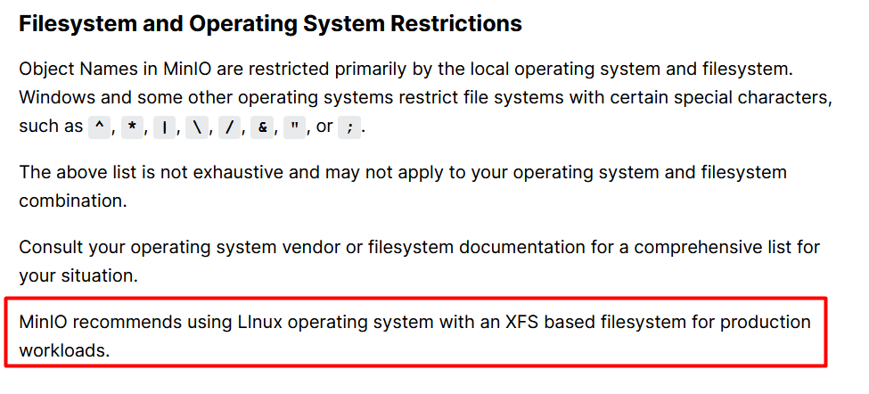
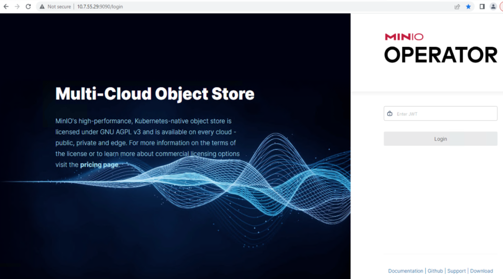

# Minio

## Getting Started

### Prerequisite

Krew needs to be installed prior to installing the Minio Operator.

### 1. Install Krew

#### 1.1 Make sure that git is installed.

##### macOS
```sh
brew install git
```

##### Debian/Ubuntu
```sh
sudo apt install git-all
```

##### RHEL/CentOS
```sh
sudo dnf install git-all
```

#### 1.2 Install Krew with the command below on your terminal:

```sh
(
    set -x; cd "$(mktemp -d)" &&
    OS="$(uname | tr '[:upper:]' '[:lower:]')" &&
    ARCH="$(uname -m | sed -e 's/x86_64/amd64/' -e 's/\(arm\)\(64\)\?.*/\1\2/' -e 's/aarch64$/arm64/')" &&
    KREW="krew-${OS}_${ARCH}" &&
    curl -fsSLO "https://github.com/kubernetes-sigs/krew/releases/latest/download/${KREW}.tar.gz" &&
    tar zxvf "${KREW}.tar.gz" &&
    ./"${KREW}" install krew
)
```

Ref: [Krew Setup Installation](https://krew.sigs.k8s.io/docs/user-guide/setup/install/)

#### After a successful installation, you will see an output similar to the sample below:
```
......
Installing plugin: krew
Installed plugin: krew
\
| Use this plugin:
| 	kubectl krew
| Documentation:
| 	https://krew.sigs.k8s.io/
| Caveats:
| \
|  | krew is now installed! To start using kubectl plugins, you need to add
|  | krew's installation directory to your PATH:
|  | 
|  |   * macOS/Linux:
|  |     - Add the following to your ~/.bashrc or ~/.zshrc:
|  |         export PATH="${KREW_ROOT:-$HOME/.krew}/bin:$PATH"
|  |     - Restart your shell.
|  | 
|  |   * Windows: Add %USERPROFILE%\.krew\bin to your PATH environment variable
|  | 
|  | To list krew commands and to get help, run:
|  |   $ kubectl krew
|  | For a full list of available plugins, run:
|  |   $ kubectl krew search
|  | 
|  | You can find documentation at
|  |   https://krew.sigs.k8s.io/docs/user-guide/quickstart/.
| /
/
```

#### 1.3 Include `$HOME/.krew/bin` to your PATH environment with the following command:

```sh
export PATH="${KREW_ROOT:-$HOME/.krew}/bin:$PATH"
```

Now Krew is successfully installed.

### 2. Install Minio Operator

Before installing Minio, please note that Minio recommends using a storage class with the XFS file system.



Run the following commands to install the MinIO Operator and Plugin using the Kubernetes krew plugin manager:

```sh
kubectl krew update
kubectl krew install minio
kubectl minio version
kubectl minio init
kubectl get po -n minio-operator
kubectl get secret -n minio-operator
kubectl describe secret -n minio-operator console-sa-token-xxxx 
```

Copy the token for console login.

Edit the `svc` console Minio operator from `ClusterIP` to `LoadBalancer`:

```sh
kubectl edit svc -n minio-operator console
```

You can then access the Minio Operator Console via the LoadBalancer IP.



### 3. You can now log in to the Minio Operator and create a Tenant.

### 4. Setup Minio Monitoring using Prometheus - [Readme.md](Monitoring/README.md)

[Back to Main README](../README.md)